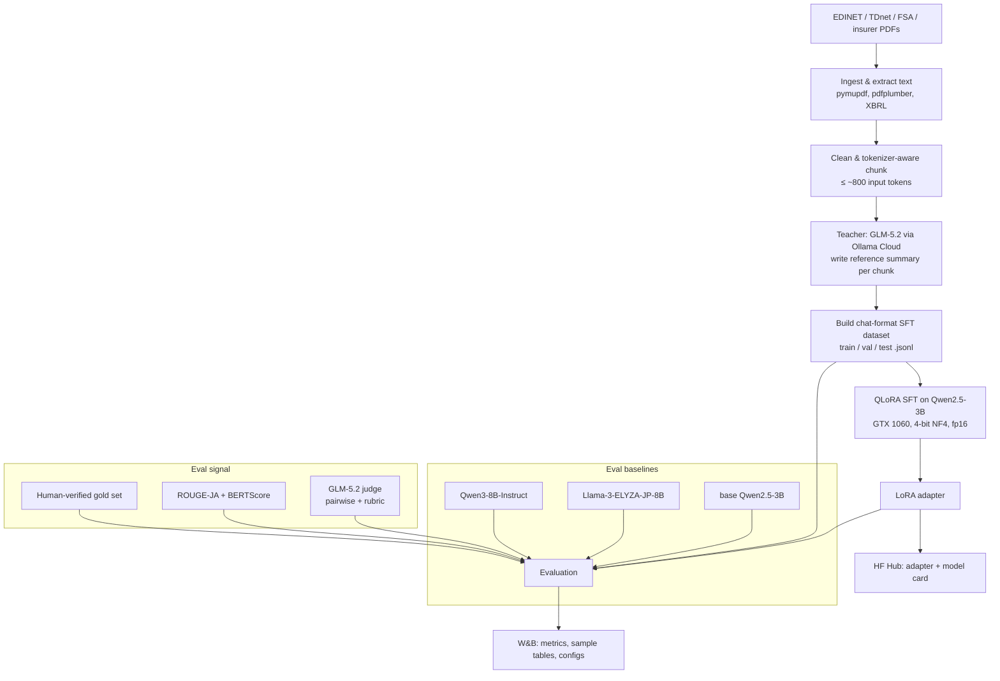

# ARCHITECTURE.md — hoken-lora

System design for distilling **GLM-5.2 → Qwen2.5-3B (QLoRA)** for Japanese
insurance/finance **summarization**. Read `CLAUDE.md` for constraints first.

---

## 1. High-level pipeline



---

## 2. Stages & responsibilities

### 2.1 Ingest (`src/hoken_lora/ingest/`)
- **Fetch:** EDINET API v2 (有価証券報告書 / disclosures), TDnet listings, FSA report pages,
  insurer 約款 / ディスクロージャー誌 PDFs. Store to `data/raw/` with a manifest
  (source, url, date, doc_type, company, license note).
- **Extract:** PDF → text (`pymupdf` primary, `pdfplumber` fallback for tables); XBRL → text
  (`lxml`). Strip boilerplate, headers/footers, page numbers. Output `data/interim/*.txt`
  keyed to the manifest.

### 2.2 Chunk (`src/hoken_lora/chunk/`)
- **Tokenizer-aware** splitting with the **Qwen2.5 tokenizer**. Target **input passage
  ≈ 600–800 tokens** on semantic boundaries (section/paragraph), so that
  `prompt + passage + summary ≤ 1024`. Keep section metadata (e.g., 事業等のリスク, 経営成績).
- Each chunk becomes one training example candidate.

### 2.3 Teacher generation (`src/hoken_lora/generate/`)
- Call **GLM-5.2 on Ollama Cloud** (OpenAI-compatible). For each chunk, request a faithful,
  concise Japanese summary under a fixed rubric (below). Record raw response + params.
- **Quality gates before a chunk enters the dataset:** non-empty; length within
  `[min,max]`; language = Japanese; naive faithfulness guard (no numbers/entities absent
  from source beyond a threshold); dedupe near-identical summaries.
- Concurrency with rate limiting + retry/backoff; cache by content hash so reruns are cheap.

**Teacher prompt rubric (summaries):** 日本語で、原文に忠実に、事実の追加・推測なし、
重要数値と主体を保持、指定長以内、箇条書き可。System prompt fixes role = 保険・金融の
開示資料の要約者. Keep the exact prompt in `configs/generate.yaml` so it's versioned.

### 2.4 Dataset build (`src/hoken_lora/dataset/`)
- Assemble **chat-format** examples and serialize to JSONL. **Split by source document**
  (never leak chunks of the same filing across train/val/test).
- Hold out a **gold test set**: ~50–100 examples whose reference summaries are
  **human-verified/edited** (not raw teacher output) — this is the unbiased headline set.

**JSONL schema (one line = one example):**
```json
{
  "id": "edinet_E01234_2024_risk_007",
  "doc_type": "yuho",
  "source": {"company": "…", "section": "事業等のリスク", "url": "…", "date": "2024-06-…"},
  "messages": [
    {"role": "system", "content": "あなたは保険・金融の開示資料を要約する専門家です。…"},
    {"role": "user", "content": "次の文書を日本語で簡潔に要約してください。\n\n<本文>"},
    {"role": "assistant", "content": "<teacher summary>"}
  ],
  "meta": {"teacher": "glm-5.2", "input_tokens": 742, "summary_tokens": 180, "gold": false}
}
```

### 2.5 Training (`src/hoken_lora/train/`)
- **QLoRA SFT** with TRL `SFTTrainer` over the JSONL. Loss on the **assistant turn only**
  (mask prompt). Log to W&B.

**`configs/train_qlora.yaml` (starting point):**
```yaml
model_name: Qwen/Qwen2.5-3B-Instruct
bnb:
  load_in_4bit: true
  bnb_4bit_quant_type: nf4
  bnb_4bit_use_double_quant: true
  bnb_4bit_compute_dtype: float16      # Pascal: no bf16
lora:
  r: 16
  lora_alpha: 32
  lora_dropout: 0.05
  target_modules: [q_proj, k_proj, v_proj, o_proj, gate_proj, up_proj, down_proj]
  bias: none
  task_type: CAUSAL_LM
train:
  max_seq_length: 1024
  per_device_train_batch_size: 1
  gradient_accumulation_steps: 16       # effective batch 16
  gradient_checkpointing: true
  learning_rate: 2.0e-4
  lr_scheduler_type: cosine
  warmup_ratio: 0.03
  num_train_epochs: 2
  weight_decay: 0.0
  max_grad_norm: 0.3
  optim: paged_adamw_8bit               # fallback: adamw_torch / adafactor
  fp16: true
  bf16: false
  attn_implementation: sdpa             # no FA2 on Pascal
  logging_steps: 10
  eval_strategy: steps
  save_strategy: steps
  seed: 42
report_to: wandb
```

### 2.6 Evaluation (`src/hoken_lora/eval/`)
See §4. Runs the fine-tuned adapter + all baselines over `test.jsonl` / gold set,
computes metrics, logs comparison tables to W&B.

### 2.7 Publish (`src/hoken_lora/train/push_to_hub.py`)
- Push **adapter only** (`peft` save) to `HF_TOKEN`'s namespace. Generate a **model card**
  (config, data provenance, eval table, intended use, **limitations**: summarization only,
  Japanese, may hallucinate numbers, not financial advice) and a **dataset card** describing
  regeneration. **Do not upload raw filings or the full teacher corpus.**

---

## 3. Models

| Role | Model | Notes |
|---|---|---|
| Student | `Qwen/Qwen2.5-3B-Instruct` | QLoRA target; strong-ish JP, small enough for 1060 |
| Teacher + Judge | **GLM-5.2** (Ollama Cloud) | generation + eval judging only |
| Baseline (anchor) | base Qwen2.5-3B-Instruct | isolates the LoRA's contribution |
| Baseline | **Llama-3-ELYZA-JP-8B** | JP-specialized 8B reference point |
| Baseline | **Qwen3-8B-Instruct** | newer same-family 8B reference point |

Baselines are run at inference only (4-bit load is fine for the 8B ones; they don't have to
fit training). For whole-document eval, all models use the same **map-reduce** inference
wrapper so comparisons are fair.

---

## 4. Evaluation methodology

**Why care:** GLM-5.2 is *both* the teacher and the judge → a judge-only eval is biased toward
the student that best imitates GLM-5.2. We defend with three independent signals.

1. **Reference-based automatic metrics** (on `test.jsonl`, teacher refs):
   - **ROUGE-1/2/L** with **MeCab (fugashi+unidic-lite)** tokenization — never whitespace ROUGE on Japanese.
   - **BERTScore** with a Japanese/multilingual encoder.
   - **Compression / length ratio** sanity check.
2. **LLM-as-judge** (GLM-5.2): **pairwise** student-vs-baseline with **position-swapping**
   to cancel position bias, scoring a rubric — **忠実性 (faithfulness), 網羅性 (coverage),
   簡潔性 (conciseness), 流暢性 (fluency)** — reported as **win/tie/loss** and per-axis 1–5.
   Source text is provided to the judge so faithfulness is checkable.
3. **Human-verified gold set** (~50–100, refs edited by a human): the **headline** numbers.
   This is the only signal not contaminated by GLM-5.2 authorship. Optionally add a **second,
   different judge model** for a triangulation check.

**Primary success criterion:** fine-tuned Qwen2.5-3B **beats the base 3B** on gold-set ROUGE-L,
BERTScore, and judge win-rate, and **closes most of the gap to the 8B baselines** at a fraction
of the size.

---

## 5. Experiment tracking (W&B)

- One **run per training config**; `group` by experiment, `tags` = {rank, targets, epochs}.
- Log: resolved config + git SHA, train/eval loss, GPU mem, tokens/sec.
- Log **eval tables**: `(id, source_section, reference, prediction, elyza, qwen3, judge_verdict)`
  so regressions are eyeballable.
- Log metric summaries: `eval/rougeL`, `eval/bertscore_f1`, `eval/judge_winrate_vs_base`, etc.
- Use W&B to compare LoRA-rank / target-module sweeps in ROADMAP Phase 5.

---

## 6. Data & config formats

- **Configs:** versioned YAML in `configs/` (`data`, `generate`, `train_qlora`, `eval`).
  Prompts live in config, not code, so they're diffable.
- **Datasets:** JSONL (schema in §2.4). Splits by document id.
- **Artifacts:** adapters + tokenizer under `outputs/<run>/`; only the adapter is pushed to HF.

---

## 7. Key risks the design absorbs (full list in ROADMAP §Risks)

- Pascal/bitsandbytes compatibility → verify-small-first, fp16, no Unsloth/FA2.
- 1024-token ceiling vs long filings → chunk for training, map-reduce for inference.
- Judge/teacher self-bias → gold set + reference metrics + optional second judge.
- Data leakage across chunks → split by source document.
- Licensing → adapter-only release, regeneration-recipe dataset card.
